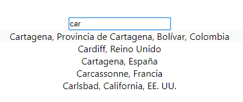

# Welcome to chalo-location-search-input!

> Hi! It's a React component to build a customized UI of
> https://github.com/hibiken/react-places-autocomplete.
>
> It's too a component Google Maps Places Autocomplete for React.
>
> **Install-package**
>
> - npm install chalo-location-search-input
> - yarn add chalo-location-search-input

## What does it?



It connects to the google API and returns the validated address

## How to implated it?

You can see the example complete in directory **src/example/ExampleImplementation.js**

```JavaScript
    // src/example/ExampleImplementation.js
    ...
    //It's a method when response ok
    handleSuccess = response => {
        console.log("success: Direction valid",response);
    };

    //It's a method when response bad
    handleError = response => {
        console.log("error: Direction inavlid",response);
    };

    render () {
        return (<LocationSearchInput
        handleSuccess={this.handleSuccess}
        handleError={this.handleError}
        />)
    }
```

**Additional note, the Google API script is required.**

```Html
    //public/index.html
    ...
    <body>
        <noscript>You need to enable JavaScript to run this app.</noscript>
        <div id="root"></div>
        <script src="https://maps.googleapis.com/maps/api/js?key=YOUR-KEY-GOOGLE-API&libraries=places"></script>
    </body>
    ...
```
